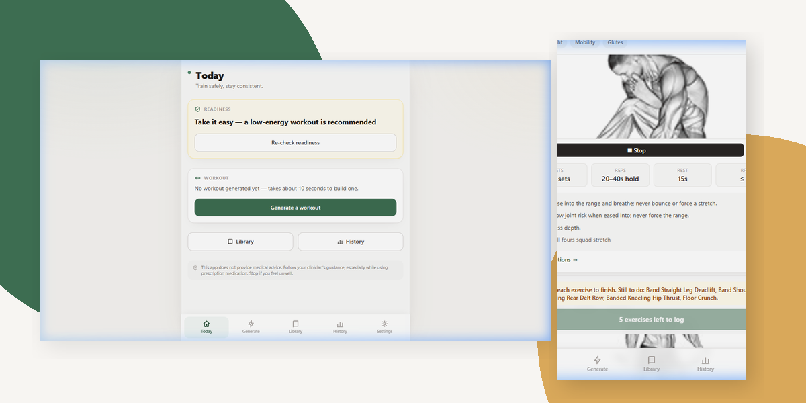
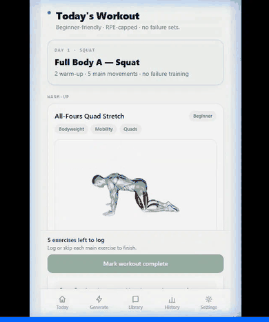
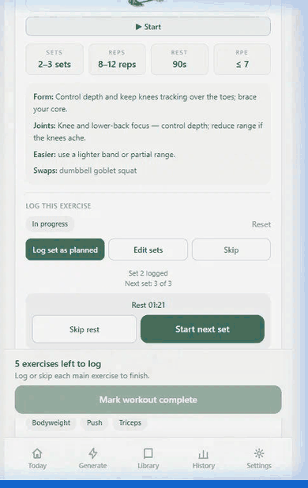
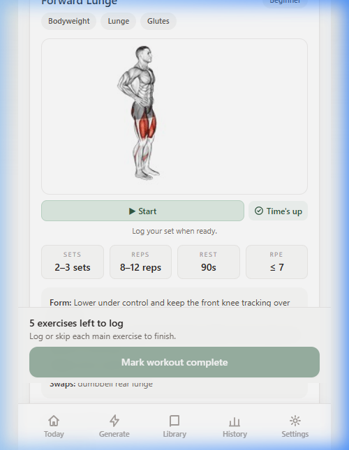
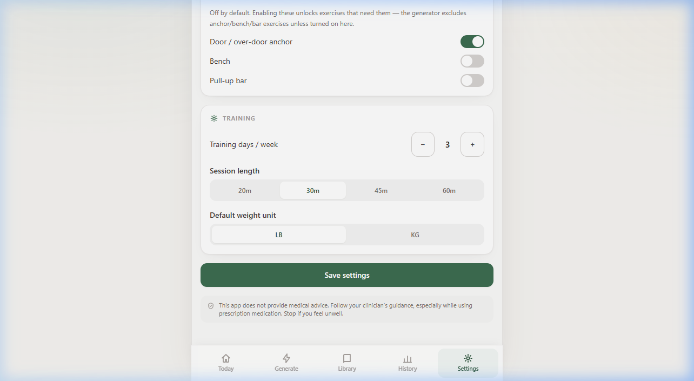
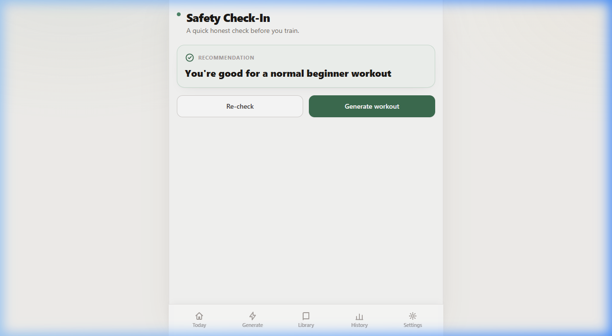
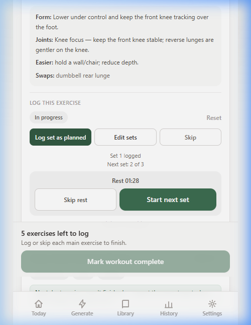

# Co-Gym Assistant

Co-Gym Assistant is a mobile-first, local-first guided home workout web app for generating workouts, following exercise timers, logging sets honestly, resting between sets, and reviewing workout history — all without an account, database, or cloud sync.

It is designed to be a focused training companion on your phone: workout instructions, exercise demos, timers, set logging, rest guidance, and history stay in one place so you can move through a session without juggling separate apps.

### Hero Overview

<div align="center">



</div>

---

## 🎬 Core Workflows in Action

### 1. Check in & Generate Session

Check your readiness — including soreness, fatigue, and sleep — to receive a workout recommendation that adapts the session intensity.

<div align="center">
  
</div>

### 2. Log a Set & Follow the Rest Timer

Log sets as planned or custom-adjusted. The app automatically triggers a rest countdown timer with an audio beep completion alert before highlighting the next set.

<div align="center">
  
</div>

---

## ✨ Key Features

- **Readiness-Based Sessions:** Check energy, soreness, fatigue, and sleep before training so the app can recommend whether to train normally, modify, or take it easier.
- **Guided Exercise Timers:** Start/stop exercise demos with countdown timers, auto-stop behavior, and audio completion beeps.
- **Set-by-Set Logging:** Log one set at a time, edit reps/weight/RPE, skip exercises, or finish early as modified.
- **Rest Timer Flow:** After a logged set, Co-Gym starts a rest countdown and guides you toward the next set without auto-logging anything.
- **Honest Workout States:** Exercises move through clear states: `not_started`, `in_progress`, `completed`, `modified`, or `skipped`.
- **Workout History:** Review past workouts, inspect set details, edit logs, or delete entries.
- **Local Backup:** Export and import workout history as JSON backups.
- **Local-First Storage:** No account, backend database, or cloud sync required. Logs stay in browser localStorage unless exported, deleted, or browser storage is cleared.

---

## 📸 Screenshots Gallery

| 🏋️ active workout screen | ⚙️ settings / backup |
| :---: | :---: |
|  |  |
| **📊 readiness check-in** | **🕒 rest timer active** |
|  |  |

---

## 🛠️ Technical Stack

- **Framework:** Next.js App Router
- **Language:** TypeScript
- **Styling:** Tailwind CSS
- **Animations:** Motion
- **Storage:** Browser localStorage
- **Testing:** Vitest + React Testing Library

---

## 🚀 Running Locally

### Prerequisites

- Node.js v18+
- npm

### Setup

1. **Clone the repository:**

   ```bash
   git clone https://github.com/hashbookies/co-gym-assistant.git
   cd co-gym-assistant
   ```

2. **Install dependencies:**

   ```bash
   npm install
   ```

3. **Synchronize local exercise media:**

   Download and prepare local media files, including thumbnails and demonstration GIFs, into the public folder:

   ```bash
   npm run sync:media
   ```

4. **Run the development server:**

   ```bash
   npm run dev
   ```

   Open http://localhost:3000 in your browser. Resize to mobile width for the best experience.

5. **Run tests:**

   ```bash
   npm test
   ```

6. **Build for production:**

   ```bash
   npm run build
   ```

---

## 🗃️ Data & Exercise Library

The exercise list and media libraries are curated from an open exercise dataset and filtered for home-friendly movements. To keep the repository size clean and fast to download:

- The base dataset file is kept out of Git tracking.
- Media folder outputs are generated locally during the `npm run sync:media` step.
- The source dataset includes multilingual instruction fields; the current app experience is focused on English workout guidance.

---

## 📲 PWA behavior

The app ships a web app manifest, app icons (including padded maskable icons), and a service worker so it can be installed and behave like a home-screen app on supported browsers.

- **The service worker registers only in production builds.** In local `next dev` it is intentionally skipped to avoid caching headaches, so PWA install/offline behavior is best tested on the deployed Vercel app (or a local `npm run build && npm start`).
- The service worker caches a small app shell and static assets, with a network-first strategy for page navigations and an offline fallback to the cached shell.
- **Offline is not full-featured.** Previously visited pages and your locally saved workouts remain available, but exercise media (images/GIFs) may not load offline — they are deliberately not aggressively cached.

---

## ⚠️ Disclaimer

Co-Gym Assistant is a personal workout planning and tracking tool. It is not medical advice. Stop exercising if you feel dizzy, unwell, or unsafe, and consult a qualified professional when needed.

---

## 📄 License & Credits

- **License:** MIT License (see [LICENSE](LICENSE) for details)
- **Credits:** Built by Tayo Kolade. Provided for educational and personal home-training purposes.
